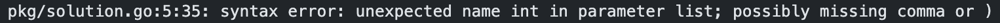
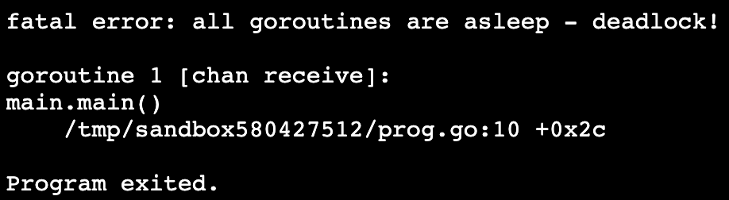

[Перейти на сайт](https://ru.hexlet.io)

# Как читать вывод тестов в Go

Чтобы вам было проще разобраться в выводе тестов, в первую очередь объясним, как работают тесты на платформе.

Тестирование кода на Go происходит с помощью [фреймворка Testify](https://github.com/stretchr/testify/), сами тесты также написаны на языке Go. Проверка кода запускается автоматически после нажатия на кнопку «Проверить». Тестируемая программа компилируется и проверяется с разными входными данными. При этом тесты следят, чтобы поведение программы соответствовало ожиданиям.

Когда тесты завершатся, на вкладке OUTPUT появится результат проверки. Если на этом этапе возникла ошибка, нужно прочитать вывод тестов. Этот вывод — наш главный помощник в отладке кода.

# Виды ошибок

Никто не пишет код идеально. Поэтому рано или поздно вы столкнетесь с ошибками. Ошибки при выполнении упражнения можно условно разделить на три вида:

* Ошибки компиляции — это синтаксические ошибки, которые возникают еще на этапе компиляции программы
* Ошибки времени исполнения – такие ошибки не мешают компиляции, но препятствуют выполнению программы
* Ошибки утверждений — ошибки, вызванные тестами. Они возникают, если результат работы функции не соответствует ожидаемому результату

## Ошибки компиляции

Например, к этому типу ошибок относятся:

* Синтаксическая ошибка
* Обращение к несуществующей переменной
* Использование неправильных типов данных

Если программа на Go написана синтаксически некорректно, то компилятор выводит на экран сообщение об ошибке.

Это сообщение выглядит так:

Сообщение об ошибке содержит:

* Описание ошибки
* Указание на файл, в котором произошла ошибка
* Строчку в файле, где произошла ошибка

## Ошибки времени выполнения

Эти ошибки не препятствуют компиляции, но при этом программа не работает так, как ожидается.

Такие проблемы появляются уже в момент выполнения скомпилированной программы. Возникают различные события, которые нарушают нормальный ход выполнения программы. Эти ошибки не связаны с тестами и сигнализируют о проблеме в коде.

В отличие от других языков, в Go нет исключений — принято возвращать ошибки явно. Но компилятор может анализировать программу во время выполнения и сигнализировать о фатальных ошибках. Например, если программа зависает в ситуации deadlock’a.

Вывод такой ошибки будет выглядеть как:

Если описания недостаточно, всегда можно обратиться к документации, в которой описаны случаи возникновения тех или иных ошибок.

## Ошибки утверждений

Такие ошибки возникают, если результат работы функции не соответствует тому результату, который мы ожидали.

Для начала разберемся, как выглядят тесты для упражнений:

Тестируемая функция `SafeWrite()`  вызывается в тестах с определенными параметрами. Результат работы функции сравнивается с заранее определенным ожидаемым результатом.

Если фактический и ожидаемый результат совпадают, то все хорошо, тесты пройдены.

Рассмотрим подробнее вывод на вкладке OUTPUT в случае падения тестов:

Здесь мы видим:

* Файл с тестами — `main_test.go`
* Номер строки с непройденным тестом — `main_test.go:16`
* Имя самого теста, который не прошел — `Test: TestSafeWrite`
* Ожидаемый результат работы — в строчке `expected`
* Фактический результат работы кода — в строчке `actual`

Изучив такой вывод, мы можем разобраться, чем вызвано несовпадение результатов. Это поможет устранить причину неправильной работы тестируемого кода.

# Отладка кода

Иногда с первого взгляда невозможно понять, чем вызвано неправильное поведение кода. Тогда на помощь приходит отладка — возможность заглянуть в процесс выполнения кода.

Существует несколько способов, но мы рассмотрим самый простой и распространенный — отладочную печать.

Отладочная печать — это вывод на экран значений переменных, вызовов функций, сообщений о выполнении итерации цикла в процессе работы программы.

Для этого достаточно добавить вызов функции `fmt.Println()`  с интересующим нас значением:

Затем нужно запустить проверку тестами еще раз, чтобы на вкладке OUTPUT увидеть результат работы нашей отладочной печати:

С помощью отладочной печати мы можем проследить выполнение программы и выяснить, куда закралась ошибка.
