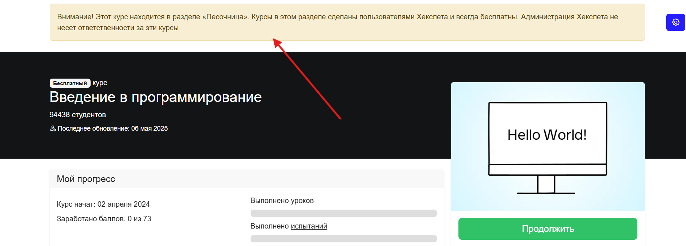

[Перейти на сайт](https://ru.hexlet.io)

# Песочница

> Рассказываем про архивный раздел с курсами

Ранее в Хекслете существовал раздел «Песочница», куда наша команда помещала курсы, созданные пользователями Хекслета. Эти курсы не поддерживаются технической командой и информация в них не обновляется, поэтому сейчас их можно рассматривать как архивные материалы.

Совсем недавно «Песочница» была полностью закрыта, однако часть курсов из неё переехала на платформу Stepik — их можно найти здесь: https://stepik.org/users/50122845/teach

А все актуальные и поддерживаемые программы Хекслета доступны в нашем каталоге: https://ru.hexlet.io/courses. Здесь собраны современные учебные материалы по различным направлениям.
