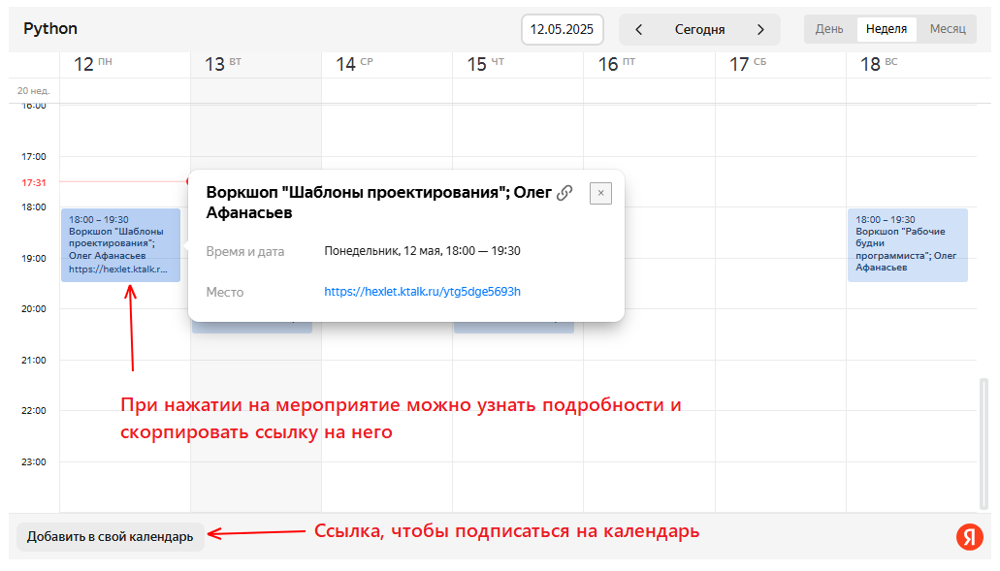
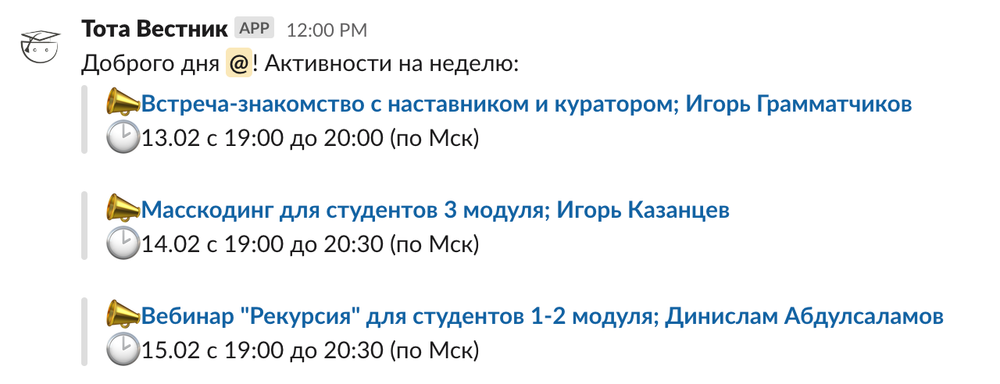
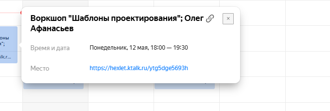
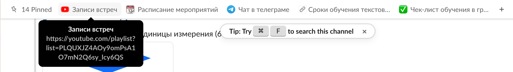
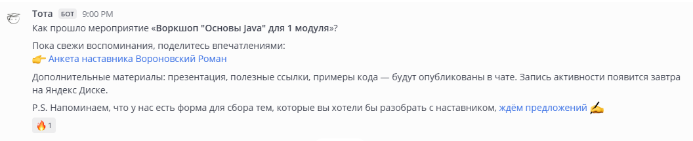

[Перейти на сайт](https://ru.hexlet.io)

# Активности при обучении с наставником

> Какие бывают активности и где их искать, если вы обучаетесь на тарифе с поддержкой наставника

В рамках обучения на «**Оптимальном**» или «**Премиальном**» тарифе каждую неделю проходят встречи с наставником. Это дополнительный контент 
к материалам на платформе и возможность обсудить вопросы по урокам или потренироваться в решении задач.

В этой статье мы расскажем, как устроено расписание активностей, как к ним подключиться, где найти записи встреч и как предлагать 
темы для будущих мероприятий. Вся информация про обучение находится в разделе «[Прогресс](https://ru.hexlet.io/my/learning)».

## Про календарь

Расписание мероприятий ведётся в сервисе **Яндекс.Календарь** и отображается в блоке «**Расписание активностей**». 
В календаре указаны дни и время встреч, их темы и форматы, уровень мероприятия и имя наставника.

Также можно установить Яндекс.Календарь в свой личный по ссылке внизу календаря.

Дополнительно каждую неделю по понедельникам в чат группы в Mattermost отправляется сообщение с планом активностей.

## Место встречи

Все видео-встречи проводятся в **Контур Толк**.

Можно подключиться через приложение для компьютера или телефона.

Также доступен вариант входа прямо из браузера — ничего дополнительно устанавливать не нужно.

Иногда может понадобиться микрофон или камера (по желанию), чтобы пообщаться с наставником и одногруппниками.

Ссылка для подключения всегда указана в **Яндекс.Календаре** в поле «**Место**».

## Если не получилось присутствовать

А если вы не смогли попасть на мероприятие, то всегда можно посмотреть запись.

Записи всех прошедших активностей выгружаются в отдельный плейлист группы на **YouTube** и в папку на **Яндекс.Диске**. Ссылку на плейлист можно найти:

- в разделе «Полезные ссылки» на странице «[Прогресс](https://ru.hexlet.io/my/learning)»

- в шапке чата группы в Mattermost

- или уточнить у куратора

## Темы и форматы

Темы активностей определяются ближе к мероприятию — исходя из запросов студентов или предложений наставника.

Вы тоже можете предложить тему! Для этого есть анкета «**Запрос тем на активности**». Её можно найти в чате вашей группы 
в Mattermost в сообщениях от Тоты «Как прошла активность?».

**Форматы встреч могут быть разными:**

- Вебинар — доклад от наставника или приглашённого эксперта.

- Текстовый вебинар — обсуждение темы в Mattermost в формате чата.

- Livecoding — программирование наставником в прямом эфире.

- Сессия масскодинга — решение задач студентами под руководством наставника.

- Воркшоп — совместная встреча для обсуждения вопросов студентов.

- Пробное собеседование — наставник выступает в роли интервьюера и проводит собеседование с одним из студентов.

## Обратная связь от студентов

После каждой активности в чат группы отправляется анкета, где можно поделиться впечатлениями о прошедшей встрече, 
а также оставить обратную связь о наставнике и платформе.

Каждый отзыв внимательно рассматривается и помогает сделать процесс обучения лучше :)

