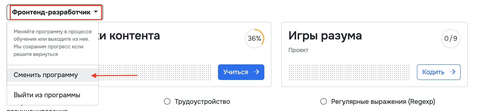
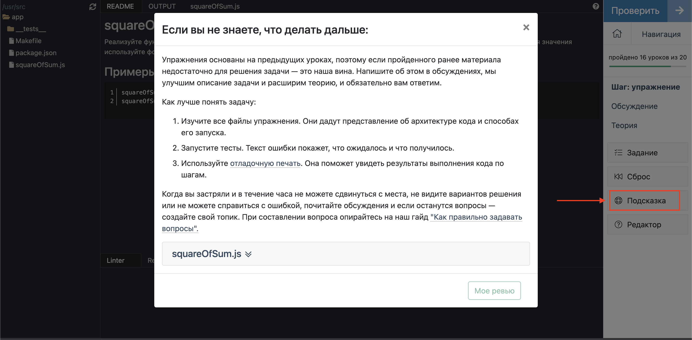

[Перейти на сайт](https://ru.hexlet.io)

# Сроки обучения

Эта статья поможет понять, какие примерно сроки отводятся на каждый тип задач и в какой момент нужно просить помощи.

Самое важное в процессе обучения — это регулярность. Залог успеха — вовремя задавать вопросы и не тратить время впустую.

# Программа

Прежде, чем приступить к обучению, рекомендуем ещё раз ознакомиться со своей программой обучения. Зайдите на страницу [Обучение](https://ru.hexlet.io/my), убедитесь, что вы вступили в нужную программу. Если вам необходимо выбрать другой стек, то в выпадающем меню выберите "Сменить программу".

На странице изучите, в каком порядке идут модули и что каждый из них раскрывает. Откройте каждый проект и прочитайте, что они закрепляют. Это позволит лучше понять цели обучения и получаемый на каждом этапе результат.

# План обучения

Изучите свою программу и посмотрите, из какого количества модулей она состоит. Обычно модуль завершается проектом. Допустим, программа идёт 10 месяцев и имеет 5 проектов. Тогда рекомендуемый план обучения — это 2 месяца на 1 модуль в среднем, из них:

* 2-4 недели на все курсы до проекта;
* 2-4 недели на решение проекта;
* до 2 недель на доработки проекта по код-ревью, если вы учитесь с наставником.

Это оптимальные сроки, и, чтобы в них уложиться, мы рекомендуем проходить в среднем от 2 до 5 уроков в день. Урок — это теория, квиз и практика. Но бывают и уроки, состоящие исключительно из теории.

Если вы учитесь самостоятельно, то у вас нет ограничений по времени прохождения программы, но на основании рекомендаций выше вы можете ставить себе дедлайны самостоятельно, чтобы обучение проходило продуктивнее.

## Уроки

Как понять, что пора обратиться за помощью:

* Если уже 20 минут нет прогресса в решении задачи.
* Когда задача решается, но время решения выходит за 60 минут. Даже самые объёмные задачи в Хекслете не требуют целого часа непрерывного написания кода.

## Проект

Каждый проект закрепляет темы из пройденного модуля, поэтому будьте последовательны, проходите проекты сразу после завершения модуля. На каждый шаг проекта также рекомендуем тратить несколько часов плотной работы и не более 60 минут на самостоятельное преодоление трудностей.

## Что делать, если вы застряли и решить задачу не получается?

Когда вы застряли и в течение часа не можете сдвинуться с места, не видите вариантов решения или не можете справиться с ошибкой, почитайте обсуждения или задайте вопрос ИИ-помощнику. Если всё равно не получается разобраться, то обратитесь к наставнику. А если вы учитесь самостоятельно, вы можете задать вопрос в [нашем Сообществе](https://help.hexlet.io/article/20443).

Главное, чтобы процесс обучения не прерывался. Сидеть часами и думать над задачей, гуглить решения, но не обратиться за помощью — это самый неоптимальный сценарий.

Чтобы правильно сформулировать проблему, с которой вы столкнулись, прочитайте статью [Как правильно задавать вопросы](https://help.hexlet.io/article/20559).

Если вы учитесь без поддержки наставника, но чувствуете потребность в помощи, рассмотрите вариант перехода на тариф [Оптимальный](https://help.hexlet.io/article/22606) или [Премиальный](https://help.hexlet.io/article/20505).

# Подсказки на сайте

В процессе обучения вы будете находить различные подсказки:

* элементы интерфейса;
* ссылки на дополнительные материалы;
* самостоятельные задания;
* обсуждения в упражнениях и проектах;
* [справка Хекслета](https://help.hexlet.io/).

Используйте их все, чтобы оставаться эффективным.

А в каждой практике есть окно "Подсказка", где описан алгоритм действий и оптимальное время:

# Что делать, если я не успеваю?

Если вы учитесь по Базовой или Премиум подписке, то дедлайнов у вас нет, продлевать подписку можно бесконечно. Срок доступа к контенту можно увидеть [в разделе “Оплата”](https://ru.hexlet.io/account/subscription).

Если вы учитесь с наставником и пропустили несколько дней обучения по каким-то причинам, то не переживайте. Напишите своему куратору. Он проанализирует ситуацию и подскажет, на каком этапе программы вам нужно быть на сегодняшний день.

По ходу обучения всегда есть моменты замедления или ускорения. А зачастую тормозит технический долг и неправильный подход к обучению. Но бывают и жизненные ситуации, которые выбивают из колеи. Мы всегда идём навстречу студентам и находим варианты, как помочь дойти до конца, несмотря на любые трудности. Для перерывов на неделю и более можно оформить [академический отпуск](https://help.hexlet.io/article/20523).

Поэтому обращайтесь к куратору сразу при появлении проблем, чтобы они не накапливались, как снежный ком.
