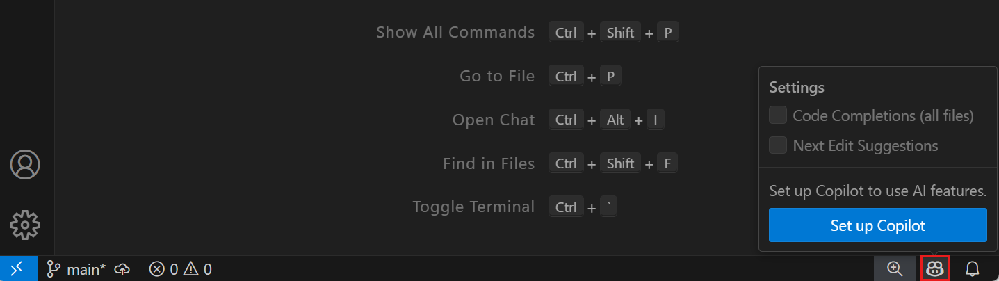
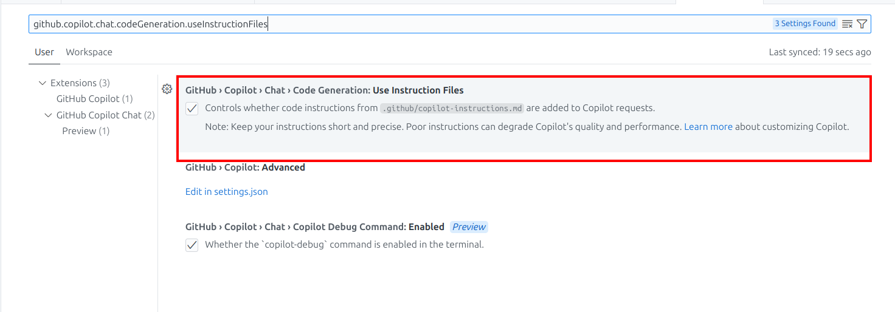
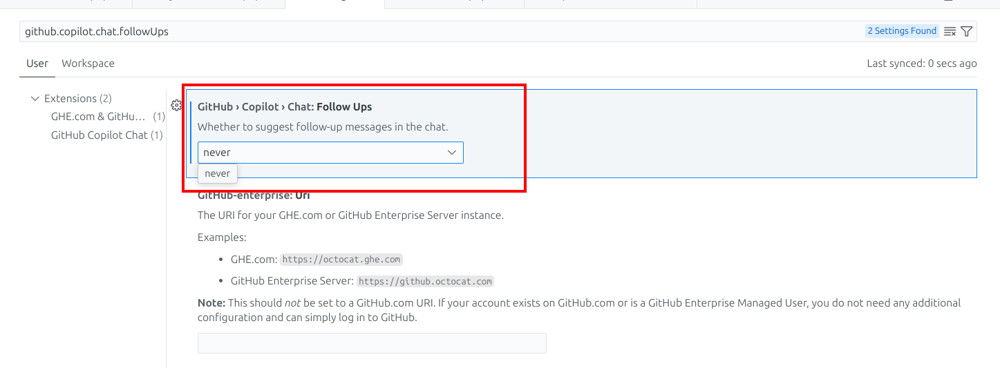
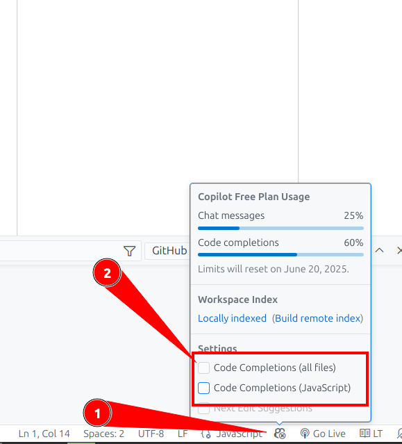
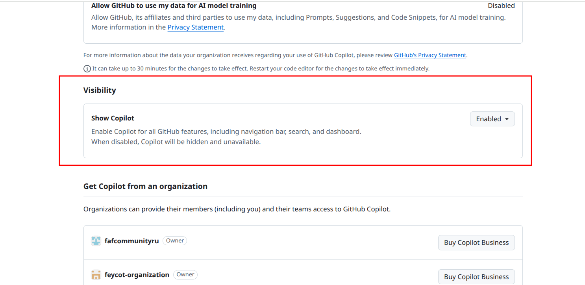
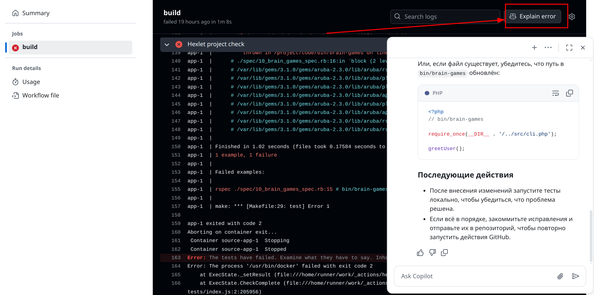

[Перейти на сайт](https://ru.hexlet.io)

# Как использовать GitHub Copilot для решения проблем в учебных проектах

> Помощь ИИ при работе над учебным проектом

**GitHub Copilot** — это инструмент, это помощник с искусственным интеллектом, встроенный в редактор кода и сайт GitHub. Он помогает писать код, 
объясняет ошибки и подсказывает, как их исправить. Однако важно помнить, что он не должен подменять ваше обучение и выполнять задачи за вас. 
Если у вас не проходят тесты, что-то сломалось в GitHub Actions или вы не понимаете, почему код не работает — Copilot может помочь разобраться. 

Этот инструмент особенно полезен при работе над учебными проектами: он не решает задачи за вас, но подсказывает, куда смотреть и как думать. 
Всё как у хорошего преподавателя: не даёт готовый ответ, а помогает дойти до него самому.

*В некоторых странах Copilot может не работать без VPN.*

## Чем Copilot может быть полезен

- Помогает понять ошибки — объясняет сообщения, показывает, где именно проблема.
  
- Помогает самостоятельно разобраться с тестами — подсказывает, почему они не проходят.
  
- Объясняет логику работы кода, а не просто предлагает решения.
  
- Показывает примеры и объясняет термины — это помогает лучше усваивать материал.
  
- Делает ревью кода перед отправкой на проверку.

GitHub Copilot можно использовать как в редакторе, так и на сайте GitHub для анализа, объяснений и улучшения кода. Разберемся, как настроить Copilot в VSCode.

## Установка и настройка Copilot в VS Code

Перед работой с Copilot убедитесь, что у вас есть созданный аккаунт в Github. Проверьте, что [Copilot активирован](https://github.com/settings/copilot/features).

1. Установите VS Code с Copilot по [инструкции](https://code.visualstudio.com/docs/setup/setup-overview?originUrl=%2Fdocs%2Fsetup%2Fwindows).
2. Установите расширение [GitHub Copilot](https://marketplace.visualstudio.com/items?itemName=GitHub.copilot).
3. Войдите в свой GitHub-аккаунт.

### Индивидуальные инструкции для Copilot

Чтобы Copilot отвечал и помогал как наставник, необходимо создать файл с инструкциями.

1. Создайте файл .github-instructions.md и напишите в нём:
   
   > Пожалуйста, отвечай мне на русском языке и максимально просто. Объясняй все понятия, которые могут быть непонятными.
   > Используй примеры и аналогии, чтобы я лучше понял. Моя цель — научиться использовать [здесь вставь то, чему хочешь научиться: например, программирование, Docker, Git] на практике.
   > Дай пошаговые инструкции и объяснения.
   > Если я задаю вопросы — отвечай с учетом моего текущего уровня (начальный/средний/продвинутый). Спасибо!

2. Откройте настройки и проверьте, что файл с инструкциями используется. Найти настройку можно по названию github.copilot.chat.codeGeneration.useInstructionFiles

   

Так Copilot будет давать пояснения, а не просто подставлять код.

### Выключение автодополнения

Зачем это нужно? Copilot подсказывает код в реальном времени, но это плохо для обучения, если нет понимания, что делает код. 
Чтобы избежать этого, важно использовать Copilot как инструмент для анализа и изучения, а не как источник готовых решений.

Задавайте вопросы, уточняйте детали и старайтесь разобраться в предложениях ИИ. Это поможет вам развивать навыки программирования и лучше понимать, как работает код.

Чтобы выключить автодополнение Copilot, выполните следующие шаги:

1. Откройте настройки редактора VS Code.
2. Найдите параметр github.copilot.chat.followUps.
4. Установите значение never, чтобы отключить автодополнение.
   
   
   
6. В нижнем меню справа нажмите на иконку Copilot и уберите галочки.

   

Это позволит вам использовать Copilot только для анализа и объяснений, а не для автоматического написания кода. 
Такой подход способствует более глубокому пониманию материала и развитию навыков.

## Как использовать Copilot в редакторе

С Copilot можно работать несколькими способами:

1. **Объяснение ошибок** — если ваш код не работает или тесты не проходят, Copilot может объяснить, в чём проблема, и предложить пути её решения.
2. **Ревью кода** — выделите фрагмент кода и попросите Copilot сделать ревью. Он предложит улучшения и объяснит свои рекомендации.
3. **Чат с Copilot** — задавайте вопросы в чате, чтобы получить пояснения, примеры и советы по работе с кодом.
4. **Работа с терминалом** — Copilot может объяснить ошибки, которые появляются в терминале, и подсказать, как их исправить.

### Объяснение ошибок

Если ваш код не работает или тесты не проходят, Copilot может помочь разобраться в проблеме. Вот как это сделать:

1. **Выделите текст ошибки** — найдите сообщение об ошибке в терминале или в редакторе.
2. **Откройте меню Copilot** — нажмите правой кнопкой мыши на выделенный текст.
3. **Выберите "Explain"** — Copilot объяснит, что означает ошибка и предложит возможные пути её исправления.

Примеры вопросов, которые можно задать Copilot:

- Что означает эта ошибка?
- Почему тесты не проходят?
- Как исправить эту проблему?

### Как сделать ревью кода с Copilot

Ревью кода с помощью Copilot позволяет получить рекомендации по улучшению решения. Вот как это сделать:

1. **Выделите фрагмент**, который хотите проверить.
2. **Нажмите правой кнопкой** мыши на выделенный код.
3. Выберите **Copilot → Review and Comment** в контекстном меню.

Copilot проанализирует решение и предложит улучшения. Он может указать на потенциальные ошибки, предложить оптимизации и объяснить свои рекомендации.

Примеры вопросов, которые можно задать Copilot во время ревью:

- Как можно улучшить этот код?
- Есть ли здесь ошибки или потенциальные проблемы?
- Как сделать этот код более читаемым?

Используйте эти рекомендации, чтобы улучшить качество вашего кода перед отправкой на проверку.

### Работа в режиме чата с Copilot

Режим чата позволяет взаимодействовать с Copilot как с виртуальным наставником. Вот как начать работу:

1. **Откройте вкладку Copilot Chat** — она доступна в боковой панели редактора VS Code.
2. **Задайте вопрос** — напишите в чате, что вас интересует.
3. **Получите ответ** — Copilot предоставит объяснение, примеры и рекомендации.

Примеры вопросов для чата:

- Как исправить ошибку в этом коде?
- Почему тесты падают?
- Что означает эта ошибка в терминале?
- Как оптимизировать этот фрагмент?

Copilot в режиме чата позволяет взаимодействовать с файлами или выделенными фрагментами кода. Вот как это работает:

1. **Выделите код или откройте файл** — выберите нужный фрагмент или файл, с которым хотите работать.
2. **Откройте вкладку Copilot Chat** — она доступна в боковой панели редактора VS Code.
3. **Задайте вопрос** — например, "Как можно улучшить этот код?" или "Что означает эта ошибка в файле?".
4. **Получите ответ** — Copilot предоставит рекомендации, объяснения и примеры, относящиеся к выделенному коду или файлу.

Используйте режим чата, чтобы получить подробные пояснения и рекомендации, которые помогут вам лучше понять и улучшить ваш код.

## Как использовать Copilot на сайте GitHub

GitHub Copilot интегрирован в сайт GitHub, что позволяет его использовать для анализа ошибок и улучшения проекта.

**Настройка Copilot на GitHub**

Чтобы включить и настроить Copilot на GitHub, выполните следующие шаги:

1. **Перейдите в настройки вашего аккаунта GitHub:**

  - Откройте [GitHub Settings](https://github.com/settings).
  - Найдите раздел **Copilot**.

2. **Активируйте Copilot:**

В разделе **Features** убедитесь, что функция включена.
В разделе **Visibility** проверьте, что показ Copilot включён.

3. Задайте персональные инструкции для Copilot:

   - Откройте любой исходный код на GitHub.
   - Нажмите на иконку Copilot, чтобы открыть чат.
   - Нажмите на многоточие и выберите **Personal Instructions**.
   - В поле инструкций напишите текст, например:
     
     > Пожалуйста, отвечай мне на русском языке. Объясняй все понятия максимально просто и подробно. Используй примеры, чтобы я лучше понял.
   - Сохраните изменения.

Теперь Copilot будет предоставлять ответы на русском языке, объясняя понятия подробно и с примерами, чтобы вам было проще разобраться.

### Как разбираться с ошибками в GitHub

Если тесты или проверки в **GitHub Actions** падают, Copilot может помочь разобраться в причинах и предложить пути решения. Вот как это сделать:

1. Откройте страницу вашего репозитория на сайте GitHub.
2. Перейдите в раздел Actions в верхнем меню.
3. Найдите последний упавший запуск в списке Workflow Runs.
4. Нажмите на название процесса, чтобы открыть его логи.
5. Скопируйте текст ошибки из логов.
6. Нажмите кнопку Explain error, которая появится рядом с ошибкой.
7. В открывшемся чате с Copilot задайте вопросы.
   

Примеры вопросов, которые можно задать Copilot:

- Что означает эта ошибка в GitHub Actions?
- Почему процесс упал на шаге [название шага]?
- Как исправить ошибку [текст ошибки]?

Copilot может объяснить, на каком этапе произошла ошибка, что она означает, и предложить возможные решения. 
Например, если ошибка связана с зависимостями, он может подсказать, как их установить или обновить.

## Как использовать Copilot для ревью тестовой документации

Если вы тестировщик, то Copilot может помочь вам провести ревью тестовой документации, используя заранее подготовленный чеклист 
(обычно находится на последнем шаге проекта). Вот как это сделать:

1. **Скопируйте чек-лист** — например:
   
   Ошибки при составлении тест-кейса
   - Неправильное название тест-кейса
     
     Неверно: Авторизация пользователя
   
     Верно: Успешная авторизация пользователя
   - Ветвление в шагах или ожидаемом результате
     
     Неверно: Шаг: Авторизоваться под пользователем user01
   
     Неверно: ОР: Авторизация успешна. Если пользователя нет, то выводится сообщение «Вы не зарегистрированы»
   
     Верно: Разнести на два тест-кейса
   - Лишние детали
     
     Неверно: Шаг: Нажать на зеленую кнопку «Войти» под полями ввода логина и пароля
   
     Верно: Шаг: Нажать «Войти»
   - Недостаток деталей
     
     Неверно: ОР: Проверить, что авторизация выполнилась успешно
   
     Верно: ОР: Убедиться, что произошел редирект в личный кабинет

2. Откройте на Github файл с тест-кейсами.
3. Нажмите на иконку Copilot — откроется чат с Copilot.
   
   
   
6. **Напишите промпт для Copilot** — например:
   
   > Сделай ревью тест-кейсов по следующему чеклисту:
   > *чек-лист по тест-кейсам*

7. **Получите рекомендации** — Copilot проанализирует тест-кейсы и предложит улучшения.

## Как эффективно учиться с Copilot

Вот несколько приёмов, которые помогут развиваться быстрее:

- Ошибка в коде: попросите объяснить, где ошибка и как она влияет
- Тест не проходи: спросите, почему он падает и что можно изменить
- Непонятный термин:	попросите разъяснить — ИИ умеет объяснять просто
- Не знаете, с чего начать: сформулируйте вопрос: "Как подойти к этой задаче?"
- Перед отправкой на ревью: запустите ревью в Copilot, он подскажет, что поправить

**Copilot не решает задачи за студента**

Copilot — это **не решатель задач**. Он помогает вам:

- Понимать ошибки и получать справочную информацию.
- Учиться хорошим практикам написания кода.
- Находить новые подходы к решению.

Не превращайте Copilot в "шпаргалку"! Обязательно разбирайтесь в его предложениях, экспериментируйте и учитесь.

**Советы по работе с Copilot**

- Задавайте конкретные вопросы. Так вы быстрее получите полезный ответ.
- Уточняйте, если объяснение непонятное.
- Проверяйте ответы. Copilot может ошибаться.
- Используйте его как наставника, а не как копипасту.

## Вывод

GitHub Copilot — мощный инструмент для обучения и развития. Используйте его, чтобы учиться анализировать ошибки, повышать читаемость кода 
и лучше понимать архитектуру решений. Это инструмент, который помогает вам:

- Разобраться в ошибках.
- Понять, как работают тесты и CI.
- Улучшить качество кода.
- Учиться на практике.

Он не делает проект за вас, но помогает двигаться вперёд самостоятельно. Используйте его для понимания, а не для быстрого решения. 
Тогда он принесёт настоящую пользу.
