[Перейти на сайт](https://ru.hexlet.io)

# Как мы тестируем тесты. Утилита Suppressor

При помощи этой статьи можно понять, как писать тесты для готового кода, используя утилиту Suppressor.

Практики [курса по тестированию](https://ru.hexlet.io/courses/js-testing) сильно отличаются от практик других курсов. Обычно вам нужно написать реализацию какой-то функции под существующий набор тестов. Здесь же всё наоборот. Вам нужно написать тесты для готового кода, и система должна проверить правильность выполнения написанных тестов.

Рассмотрим работу практики на конкретном примере. Представьте себе функцию  last(), которая возвращает последний элемент в массиве:

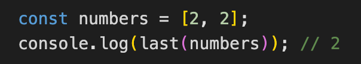

Можно ли однозначно утверждать, что она работает верно, основываясь на примере выше? Нет. Вполне возможно, что эта функция реализована так: 

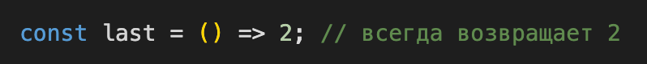

В таком случае понадобится еще один вызов, чтобы проверить ее работу:

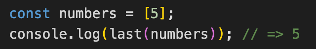

Достаточно ли теперь? И снова нет. Ее код может быть таким: 

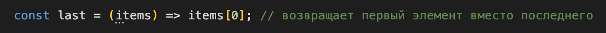

При такой реализации и первый вызов, и второй вернут правильные данные, хотя функция реализована неверно. А вот правильная реализация функции: 

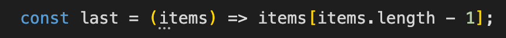

Не вдаваясь в подробности устройства тестов, можно увидеть, для чего они в принципе нужны. С их помощью мы можем убедиться, что код, в данном случае функция, работает правильно для различных входных данных, а не только в каком-то конкретном случае.

Существует ровно один хороший способ, проверить, что вы написали тесты правильно — вызвать эти тесты с разными реализациями функции. Если реализация правильная, тесты должны успешно пройти, если нет — упасть с ошибкой. Такой подход позволяет проверять эффективность тестов, а не то, как они написаны.

## Как технически работает проверка тестов?

В коде урока создается модуль JS, содержащий несколько разных реализаций того кода, который вам нужно протестировать. Вот как будет выглядеть этот файл в случае тестирования функции last().

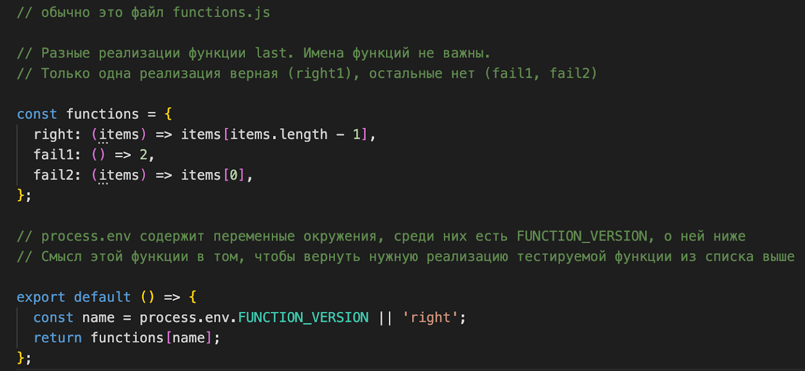

В файле с тестами происходит импорт этого модуля: 

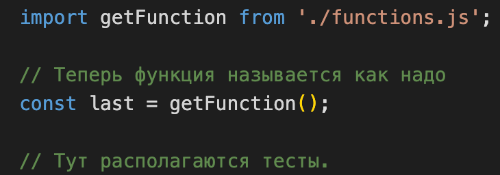

Теперь самое интересное. В каждом упражнении есть файл Makefile, открыв который можно увидеть, как запускаются тесты: 

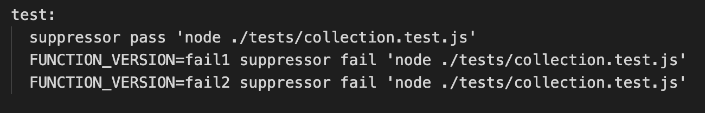

В этом файле происходит запуск тестов для каждой из реализаций тестируемой функции из файла *functions.js*.

Наша проверочная система использует для запуска тестов специальную библиотеку [Suppressor](https://github.com/Hexlet/suppressor), которая может понять, успешно ли завершилось выполнение тестов. У неё есть два режима работы:

**1. Suppressor проверяет, что тесты выполнились успешно.** В такой проверке в ваши тесты подставляется правильная реализация функции, которая тестируется (без ошибок).
  

   pass – проверяет, что тесты успешно выполнились

   FUNCTION_VERSION – переменная окружения, которая содержит имя функции, которое надо подставить для текущего запуска тестов

   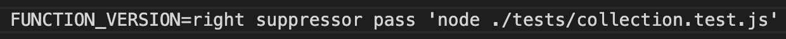
   
   В таком случае getFunction вернет функцию (items) => items[items.length - 1]

   Аргумент pass говорит о том, что Suppressor ожидает успешное завершение тестов. Следующий аргумент — команда, которую надо запустить. В случае успеха будет выведено сообщение:

   Expected tests to pass, received tests passed

   Если тесты вместо успеха завершились с ошибкой, библиотека выведет следующее сообщение:

   Expected tests to pass, but error occurred. See output above.

   Это значит, что для текущего запуска тестов использовалась рабочая (правильная) версия кода, для которой тесты должны завершиться успешно. Если тесты провалились, значит они написаны неправильно.
   
   В Makefile в строке запуска может не быть переменной окружения  FUNCTION_VERSION:

   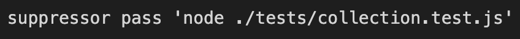

   В таком случае Suppressor будет использовать правильную реализацию функции — right1.

**2. Suppressor проверяет, что тесты упали с ошибкой.** В этом запуске тесты выполняются с неправильной реализацией тестируемой функции. Правильно написанные тесты должны найти ошибку и сигнализировать об этом, то есть упасть.

   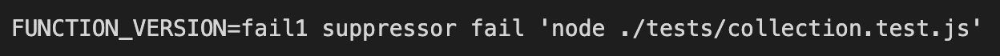
   
   В таком случае getFunction вернет функцию (items) => 2

   Аргумент fail говорит о том, что Suppressor ожидает, что выполняемая команда завершится с ошибкой. Это будет значить, что тесты написаны верно, и библиотека выведет сообщение:

   Expected tests to fail, received tests failed

   Если команда завершилась успешно, библиотека выведет следующее сообщение:

   Expected tests to fail, but they passed. See output above.

   Это значит, что для текущего запуска тестов использовалась неверная (нерабочая) версия кода, для которой тесты должны были упасть (сигнализировать об ошибке). Если тесты завершились успешно, значит они написаны неправильно.
