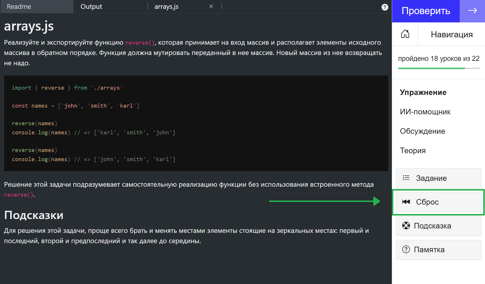

[Перейти на сайт](https://ru.hexlet.io)

# Решение учителя не работает

Эта статья отвечает на один из частых вопросов студентов.

Наша система сделана так, что упражнение не может появиться на сайте, если решение учителя не работает. Если вы скопировали решение учителя, но проверка всё равно не проходит, то удостоверьтесь, что вы не удалили случайно какие-нибудь фрагменты кода или не изменили код в других файлах.

Вы всегда можете вернуть упражнение в изначальное состояние. Для этого нажмите «Сброс» в меню справа.

