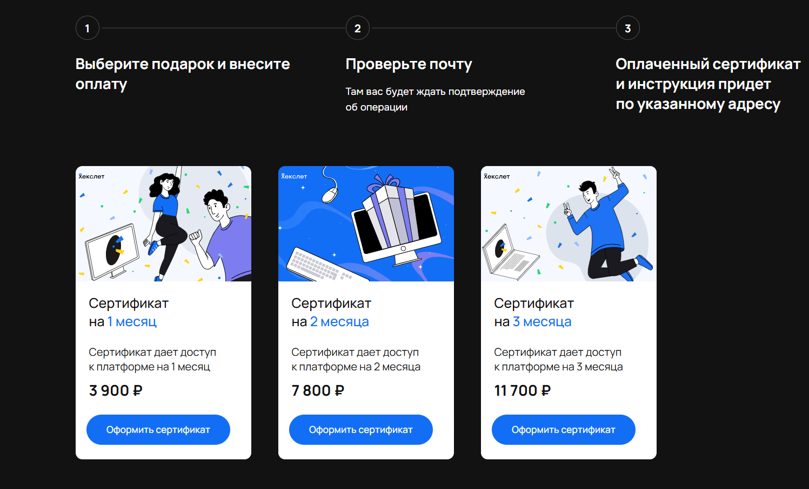

[Перейти на сайт](https://ru.hexlet.io)

# Как подарить обучение другу

> Что и как можно подарить другу из продуктов Хекслета? Ответ здесь

Обучение — отличный подарок! Рассказываем подробнее :)

## Самостоятельное обучение

Вы можете купить подарочный сертификат (https://special.hexlet.io/certificate) с доступом к самостоятельному обучению в Хекслете для другого человека. Подарок выдается в качестве сертификата с промокодом, который можно активировать в любой момент, когда будет удобно начать обучение.

После оплаты подарка, сертификат будет направлен на email нужному человеку — просто при оформлении укажите адрес его электронной почты. Срок действия подарочного промокода составляет 1 год с момента выдачи.

После активации промокода у принявшего подарок будет открыт доступ ко всем курсам Хекслета с онлайн-тренажёром и практическими проектами, как это происходит при оформлении [Базового плана](https://help.hexlet.io/article/20459).

### Активация промокода

Тому, кто получил промокод, нужно самостоятельно активировать его на странице — https://ru.hexlet.io/account/promo_codes/new

## Обучение с наставником

На странице с сертификатами пока нельзя оплатить обучение с наставником. Если хотите сделать такой подарок, напишите на support@hexlet.io — мы поможем всё оформить.
