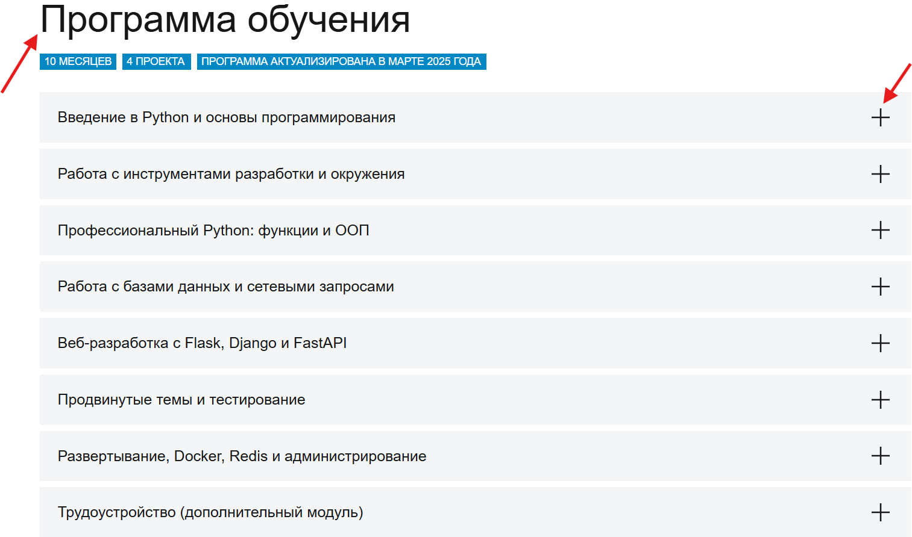

[Перейти на сайт](https://ru.hexlet.io)

# Где найти список всех-всех курсов?

> Рассказываем, как найти список курсов

Такой страницы, чтобы на ней были собраны вообще все-все курсы, у нас нет. Мы сторонники немного другого подхода, когда 
курсы собраны в программы — профессии и навыки.

Поэтому большинство курсов не отображаются в общем каталоге, так как они находятся внутри определенных программ. Вы можете 
**открыть содержание** каждой профессии/программы, чтобы посмотреть, какие курсы туда входят. Каждый курс можно будет открыть, 
чтобы посмотреть, какие уроки входят :)

А просто ознакомиться с содержанием профессий можно в разделе **«Программа обучения»/«Учим необходимому»** на странице 
любой профессии: там будет отображен полный список входящих курсов.

