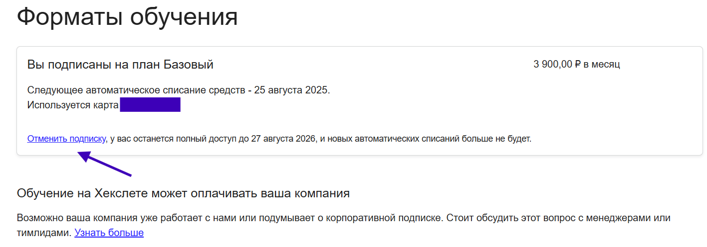

[Перейти на сайт](https://ru.hexlet.io)

# Как отменить подписку?

> Рассказываем, какие подписки вы можете отменить самостоятельно, а с какими нужна помощь команды Хекслета

## Базовый план

Отменить подписку на «**Базовый план**» можно в любой удобный момент в разделе «**[Оплата](https://ru.hexlet.io/account/subscription)**». Обратите внимание, что подписка 
оформляется с автопродлением, поэтому важно следить за сроками.

Для вашего удобства платежная система дополнительно отправляет уведомление на почту за три дня до списания средств.

Вы можете отменить подписку даже сразу же после оформления: доступ к платформе в любом случае будет открыт на весь оплаченный период.

## Формат подписки при обучении с поддержкой наставника

Если вы обучаетесь на одном из тарифов, который предполагает поддержку наставника, оплачивая подписку, то отменить ее может **только наша команда**.

Вам нужно уведомить вашего куратора, что вы хотите отменить подписку, ребята отменят ее в кратчайшие сроки.

Также вы можете написать в поддержку **support@hexlet.io** — ребята оперативно помогут.

**После того, как вы отмените подписку, данные вашей карты будут удалены.**
