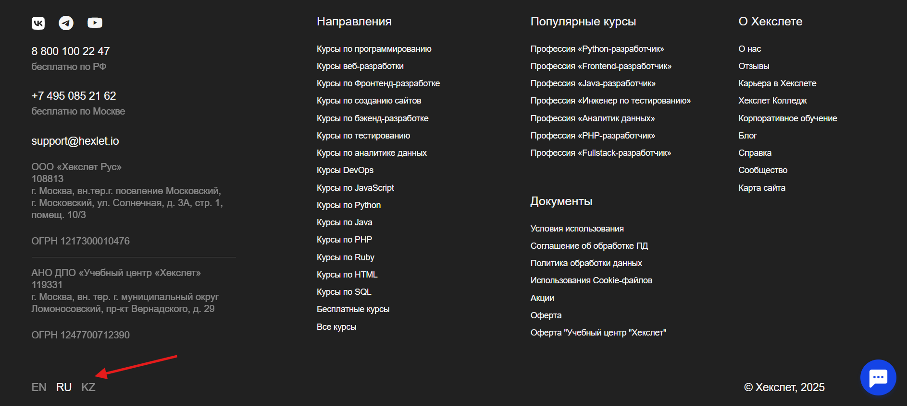

[Перейти на сайт](https://ru.hexlet.io)

# Как поменять язык на сайте?

> Рассказываем, как это сделать и что может измениться

Если вы хотите сменить язык на платформе Хекслет, то сделать это можно в футере.

**Важный момент**

После смены языка у вас изменится прогресс в вашем профиле. Это нормально: материалы на разных языках отличаются, поэтому мы считаем прогресс 
отдельно для каждой языковой версии. 
