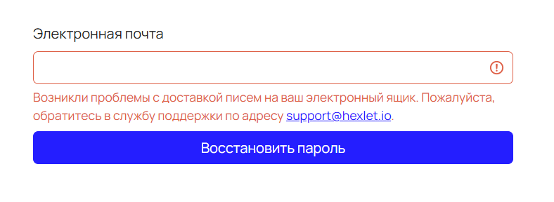

[Перейти на сайт](https://ru.hexlet.io)

# Не получается восстановить пароль

> Предлагаем варианты решения

### Вы запросили восстановление пароля несколько раз

Если ссылка для восстановления пароля не работает, скорее всего, вы запрашивали сброс несколько раз. В этом случае Хекслет отправил 
вам несколько писем, и действительной будет только ссылка из последнего письма.

### Проблема с доставкой письма для восстановления пароля

**Причина:**

Ваша почтовая служба заблокировала наши письма, так как наши предыдущие уведомления могли быть помечены как спам.

**Что нужно сделать:**

Найдите наши письма в папке «**Спам**» и верните их во «**Входящие**».

Сообщите нам на support@hexlet.io — мы сразу же предпримем действия по разблокировке. Это восстановит доставку наших уведомлений, 
и вы сможете беспрепятственно получать все необходимые письма.

