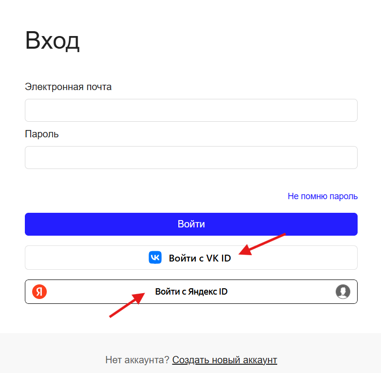

[Перейти на сайт](https://ru.hexlet.io)

# Почему у меня пропал прогресс?

> Рассказываем, что могло пойти не так

Прогресс в Хекслете навсегда сохраняется в вашем профиле, даже если вы давно не заходили. Так почему же прогресс неожиданно пропал?

## Вы зашли не в тот профиль

Чаще всего пропажа прогресса происходит из-за того, что пользователь заходит в систему с другой почтой. Например, 
случайно была выбрана авторизация через VK или Яндекс ID, и в результате может появиться новый профиль. 

В таком случае нужно войти в тот профиль, на котором вы действительно обучались, а случайно созданный — удалить. По правилам 
Хекслета каждый пользователь может иметь только один профиль.

## Вы зашли в другую локаль

Прогресс в русской и английской версиях Хекслета ведётся отдельно. Поэтому, если вы случайно переключились на другую локаль, 
может показаться, что все пройденные материалы исчезли. Не волнуйтесь — просто поменяйте язык в футере сайта, и весь ваш прогресс 
снова окажется на месте :)

## Курс был удален или изменен

Наша техническая команда активно работает над улучшением материалов, поэтому может случиться так, что в курсе будут удалены 
пройденные вами материалы, или курс вовсе будет удален (хотя такое случается очень редко). Вы можете уточнить этот момент у 
нашей поддержки по почте support@hexlet.io, и ребята подскажут, что случилось с интересующим вас курсом.
